# Multi-Agent Architecture — E-commerce Dispute Resolution (`EC_POLICY_V2`)

Tài liệu này mô tả chi tiết kiến trúc hệ thống Multi-Agent, vai trò, quyền truy cập dữ liệu, giao thức Handoff và sơ đồ thực thi theo quy định đề bài.

---

## 1. Sơ đồ Kiến trúc Multi-Agent (Mermaid Diagram)

```mermaid
graph TD
    Input[Input Case: EC_xxx.json] --> Coordinator[1. Coordinator Agent / LangGraph Orchestrator]
    
    subgraph Data Extraction & Domain Handoff Phase
        Coordinator --> CustAgent[2. Customer Agent]
        Coordinator --> OrderAgent[3. Order & Product Agent]
        Coordinator --> PayAgent[4. Payment Agent]
        Coordinator --> DelivAgent[5. Delivery Agent]
    end

    CustAgent --> SharedContext[Shared CaseContext State]
    OrderAgent --> SharedContext
    PayAgent --> SharedContext
    DelivAgent --> SharedContext

    SharedContext --> PolicyAgent[6. Policy Agent / EC_POLICY_V2 Engine]
    SharedContext -. optional explanation only .-> LLMAgent[Optional LLM Reasoning Agent]
    LLMAgent -. does not decide policy .-> PolicyAgent
    PolicyAgent --> VerifierAgent[7. Verifier Agent]
    
    VerifierAgent --> OutputJSON[output/EC_xxx.json]
    VerifierAgent --> TraceLog[trace.jsonl]
    OutputJSON --> ZipArchive[output.zip]
```

---

## 2. Danh sách 7 Agent & Vai Trò Nhiệm Vụ

| # | Agent Name | File Phụ Trách | Quyền Truy Cập Dữ Liệu | Vai Trò & Nhiệm Vụ Chính |
|---|------------|----------------|------------------------|---------------------------|
| 1 | **Coordinator Agent** | `src/agents/coordinator_agent.py` `src/agents/langgraph_orchestrator.py` | Input JSON, Session Context | Điều phối toàn bộ luồng Handoff qua LangGraph StateGraph, khởi tạo `CaseContext` và gọi các Agent thành phần. |
| 2 | **Customer Agent** | `src/agents/customer_agent.py` | `customers.csv`, `orders.csv` | Tìm `customer_unique_id`, trích xuất tối đa 5 `related_order_ids` lịch sử và đánh giá cờ `repeat_customer`. |
| 3 | **Order & Product Agent** | `src/agents/order_product_agent.py` | `orders.csv`, `order_items.csv`, `products.csv`, `sellers.csv` | Trích xuất `item_ids`, `seller_ids`, `product_ids`, giữ nguyên ngôn ngữ nguồn của `category_names`, tính tổng `expected_total_brl` và các cờ đơn hàng. |
| 4 | **Payment Agent** | `src/agents/payment_agent.py` | `order_payments.csv` | Trích xuất `payment_ids`, `payment_types`, tính `payment_total_brl`, thực hiện đối soát tài chính (`difference_brl`, `reconciled`) và cờ `split_payment`. |
| 5 | **Delivery Agent** | `src/agents/delivery_agent.py` | `orders.csv`, `order_items.csv` | Trích xuất mốc thời gian, tính `delivery_variance_hours` và độ lệch bàn giao theo seller (`handoff_variance_hours`, `late_handoff_seller_ids`). |
| 6 | **Policy Agent** | `src/agents/policy_agent.py` | Read `CaseContext` | Bộ não quyết định chính sách `EC_POLICY_V2`: xác định Primary issue (thứ tự 1-6), Secondary issues, bên chịu trách nhiệm, khoản refund, actions và evidence IDs. |
| 7 | **Verifier Agent** | `src/agents/verifier_agent.py` | Write JSON, Write `trace.jsonl` | Kiểm tra ràng buộc giới hạn kích thước mảng (max bounds), xử lý null khi đơn rỗng item, làm tròn 2 chữ số thập phân, xuất file JSON và ghi log trace. |

`LLMReasoningAgent` là enrichment tùy chọn, sử dụng model
`qwen/qwen-2.5-7b-instruct` (7B). Đường chạy `main.py` bật node này để tạo
diễn giải bổ trợ; nếu API ngoài bận/lỗi, hệ thống quay về local fallback suy luận có cấu trúc.

### Quyền hạn & Bảo mật API:
- **Rule-Based Agents**: Truy cập dữ liệu local CSV đã nạp vào bộ nhớ.
- **Optional LLM Model**: `qwen/qwen-2.5-7b-instruct` (7B, $\le 10\text{B}$)

---

## 3. Giao Thức Handoff (Agent-to-Agent Handoff)

Tất cả các Agent đọc và ghi vào một Data Contract tập trung là Pydantic Class `CaseContext` (`src/schemas.py`).

1. **Khởi tạo**: `Coordinator Agent` đọc input `EC_xxx.json`, trích xuất `claimed_order_id` và khởi tạo `CaseContext`.
2. **Customer Handoff**: `Customer Agent` bổ sung `customer_context` và cờ `repeat_customer`.
3. **Order & Product Handoff**: `Order Product Agent` bổ sung `affected_entities.item_ids`, `seller_ids`, `product_context` và giá trị tài chính dự kiến `expected_total_brl`.
4. **Payment Handoff**: `Payment Agent` đọc `expected_total_brl`, tính `difference_brl` và xác định cờ đối soát `reconciled`.
5. **Delivery Handoff**: `Delivery Agent` tính toán sai số thời gian giao hàng và các seller bàn giao muộn.
6. **Optional LLM Enrichment**: chỉ tạo diễn giải khi được bật rõ ràng; không thay đổi các facts hoặc quyết định policy.
7. **Policy Decision**: `Policy Agent` tổng hợp toàn bộ các dữ liệu trên để áp dụng bảng quy tắc `EC_POLICY_V2`.
8. **Verification & Export**: `Verifier Agent` đảm bảo JSON Schema, consistency, giới hạn mảng và ghi ra `output/{case_id}.json` cùng `trace.jsonl`.

---

## 4. Công Nghệ Sử Dụng (Technology Stack)

- **Framework**: LangGraph (`StateGraph`), Pydantic v2, Python 3.10+
- **Optional LLM Model**: `qwen/qwen3-4b:free` (4B, $\le 10\text{B}$)
- **Data Engine**: Python `csv.DictReader` và dictionary index O(1)
- **Runtime**: Cross-platform Python; gọi OpenRouter API khi chạy `main.py`, với local fallback; dependency được khóa bằng `uv.lock`
