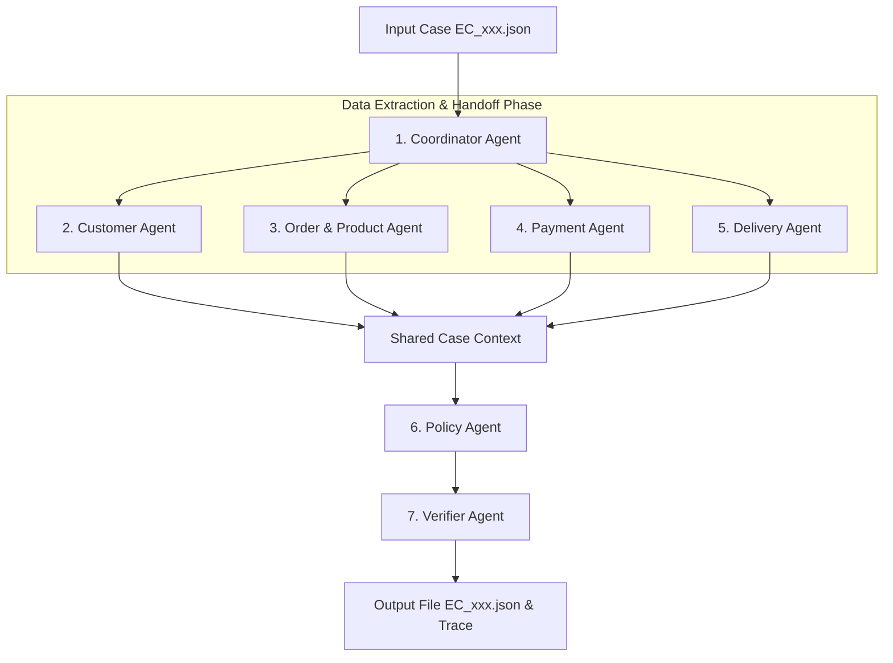

# Multi-Agent E-commerce Dispute Resolution System — Design & Implementation Plan

Hệ thống Multi-Agent giải quyết khiếu nại thương mại điện tử Olist cho 50 case (`EC_001.json` - `EC_050.json`) áp dụng chính sách `EC_POLICY_V2` với cơ chế Agent-to-Agent (A2A) Handoff, đảm bảo tính chính xác 100% dữ liệu đối soát và tuân thủ giới hạn model <= 10B parameters.

---

## User Review Required

> [!IMPORTANT]
<<<<<<< Updated upstream
> - **Cấu hình Model**: Đã ghi nhận cấu hình `.env` (`NVIDIA_API_KEY`, `meta/llama-3.1-8b-instruct`). Tất cả các agent sẽ tuân thủ quy định model <= 10B parameters.
=======
> - **Cấu hình Model**: Đã ghi nhận cấu hình `.env` (`NVIDIA_API_KEY`, `Qwen/Qwen3-VL-8B-Instruct`). Tất cả các agent sẽ tuân thủ quy định model <= 10B parameters.
>>>>>>> Stashed changes
> - **Nguyên tắc dữ liệu**: Sử dụng các rule-based parser kết hợp LLM Agent trong việc kiểm tra, tổng hợp evidence và áp dụng `EC_POLICY_V2` để đảm bảo tính chuẩn xác tuyệt đối (không sinh dữ liệu giả/hallucination).

---

## 1. Kiến trúc Multi-Agent & Luồng Handoff (A2A Architecture)

Hệ thống bao gồm 7 Agent chuyên biệt làm việc theo mô hình Pipeline & Consensus:

### Chi tiết các Agent:
1. **Coordinator Agent**:
   - Khởi tạo session cho từng case ID.
   - Nhận input case, kích hoạt song song/lần lượt các Agent phân tích dữ liệu domain.
   - Tổng hợp kết quả Handoff và gửi sang Policy Agent.
2. **Customer Agent**:
   - Tra cứu `customers.csv` & `orders.csv` qua `claimed_order_id`.
   - Tìm `customer_unique_id` và danh sách đơn hàng lịch sử `related_order_ids` (loại trừ `claimed_order_id`).
   - Đánh giá điều kiện `repeat_customer`.
3. **Order & Product Agent**:
   - Truy vấn `orders`, `order_items`, `products`, `sellers`.
   - Trích xuất `item_ids`, `seller_ids`, `product_ids`, `category_names`.
   - Kiểm tra `multi_item_order`, `multi_seller_order`, `multiple_categories`.
   - Tính toán `expected_total_brl = sum(price) + sum(freight_value)`. Nếu không có item, đặt `expected_total_brl = null`.
4. **Payment Agent**:
   - Tra cứu `order_payments.csv`.
   - Lập danh sách `payment_ids` (`<order_id>:<payment_sequential>`), `payment_types`.
   - Tính `payment_total_brl = sum(payment_value)`.
   - Tính `difference_brl = payment_total_brl - expected_total_brl` và xác định `reconciled` ($|\text{diff}| \le 0.10$).
   - Đánh giá `split_payment` ($\ge 2$ payment rows).
5. **Delivery Agent**:
   - Tra cứu mốc thời gian: `delivered_at`, `estimated_delivery_at`, `carrier_handoff_at`.
   - Tính `delivery_variance_hours = delivered_at - estimated_delivery_at` (tính bằng giờ, làm tròn 2 chữ số).
   - Phân tích bàn giao theo seller: `handoff_variance_hours = carrier_handoff_at - shipping_limit_date`. Xác định `late_handoff` và `late_handoff_seller_ids`.
6. **Policy Agent**:
   - Áp dụng `EC_POLICY_V2` theo thứ tự ưu tiên tuyệt đối:
     1. `canceled_order_paid` -> Platform, refund total payment, `issue_full_refund`.
     2. `unavailable_order_paid` -> Platform, refund total payment, `issue_full_refund`.
     3. `late_delivery_seller` -> Sellers vi phạm, refund total freight, `refund_freight`.
     4. `late_delivery_logistics` -> Logistics provider, refund total freight, `refund_freight`.
     5. `valid_split_payment` -> Không hoàn tiền, `explain_valid_split_payment`.
     6. `unsupported_late_claim` -> Bác bỏ, `reject_late_refund`.
   - Thêm `secondary_issues` theo thứ tự chuẩn: `multi_item_order` $\rightarrow$ `multi_seller_order` $\rightarrow$ `split_payment` $\rightarrow$ `repeat_customer` $\rightarrow$ `multiple_categories`.
   - Tạo danh sách `evidence_ids` hợp lệ theo đúng format.
   - Sắp xếp các `resolution_actions` bổ sung theo quy chuẩn.
7. **Verifier Agent**:
   - Đảm bảo tính hợp lệ của JSON Schema (kiểm tra kiểu dữ liệu, làm tròn 2 chữ số thập phân).
   - Kiểm tra giới hạn mảng (max 5 order, 5 item, 3 seller, 5 payment, 5 related order, 5 product, 5 category, 3 root cause, 3 responsible party, 20 evidence, 5 actions).
   - Đảm bảo `confidence` trong $[0, 1]$ và `case_status` thuộc `{"action_required", "no_action"}`.
   - Ghi log execution vào `trace.jsonl`.

---

## 2. Proposed Changes & Implementation Steps

### Structure Core Files

#### [NEW] [src/config.py](file:///d:/AIThucchien/K4-Day9-Multi-Agent-A2A/src/config.py)
Quản lý biến môi trường, API keys, đường dẫn dữ liệu CSV, input và output.

#### [NEW] [src/data_loader.py](file:///d:/AIThucchien/K4-Day9-Multi-Agent-A2A/src/data_loader.py)
Load và cache 9 file CSV Olist thành DataFrames/Dict để query nhanh.

#### [NEW] [src/agents/customer_agent.py](file:///d:/AIThucchien/K4-Day9-Multi-Agent-A2A/src/agents/customer_agent.py)
Agent tra cứu lịch sử khách hàng và `related_order_ids`.

#### [NEW] [src/agents/order_product_agent.py](file:///d:/AIThucchien/K4-Day9-Multi-Agent-A2A/src/agents/order_product_agent.py)
Agent phân tích item, product, seller và category context.

#### [NEW] [src/agents/payment_agent.py](file:///d:/AIThucchien/K4-Day9-Multi-Agent-A2A/src/agents/payment_agent.py)
Agent tính tổng payment, expected total, difference và đối soát.

#### [NEW] [src/agents/delivery_agent.py](file:///d:/AIThucchien/K4-Day9-Multi-Agent-A2A/src/agents/delivery_agent.py)
Agent tính độ lệch giờ giao hàng (`delivery_variance_hours`) và phân tích seller handoff.

#### [NEW] [src/agents/policy_agent.py](file:///d:/AIThucchien/K4-Day9-Multi-Agent-A2A/src/agents/policy_agent.py)
Agent quyết định Primary issue, Secondary issues, Refund, Actions và Evidence IDs theo `EC_POLICY_V2`.

#### [NEW] [src/agents/verifier_agent.py](file:///d:/AIThucchien/K4-Day9-Multi-Agent-A2A/src/agents/verifier_agent.py)
Agent kiểm tra schema constraints, làm tròn số, ghi log `trace.jsonl` và ghi kết quả JSON.

#### [NEW] [main.py](file:///d:/AIThucchien/K4-Day9-Multi-Agent-A2A/main.py)
Script chính điều hành Coordinator Agent chạy 50 cases và tạo file zip kết quả.

#### [MODIFY] [architecture.md](file:///d:/AIThucchien/K4-Day9-Multi-Agent-A2A/architecture.md)
Điền đầy đủ sơ đồ kiến trúc Multi-Agent, vai trò, quyền hạn và luồng Handoff.

#### [NEW] [metadata.json](file:///d:/AIThucchien/K4-Day9-Multi-Agent-A2A/metadata.json)
Khai báo đầy đủ tên model, parameter size (<= 10B), framework và runtime.

---

## 3. Verification Plan

### Automated Verification
1. **Schema & Policy Validation Tool**:
   Chạy script test kiểm tra 50 file JSON tạo ra trong `output/`:
   - Đúng tên từ `EC_001.json` đến `EC_050.json`.
   - Không bị vi phạm giới hạn kích thước mảng (max limits).
   - Kiểm tra định dạng `evidence_ids` (phải thuộc các tiền tố `order:`, `item:`, `payment:`, `seller:`, `policy:`).
   - Kiểm tra logic số dư `difference_brl` và giá trị refund.

2. **Zip Package Verification**:
   - Kiểm tra nén `output.zip` chứa chính xác 50 file JSON và 0 file dư thừa.

3. **Trace & Metadata Checks**:
   - Kiểm tra `trace.jsonl` ghi lại đủ 50 lượt chạy.
   - Kiểm tra `metadata.json` chứa thông tin hợp lệ.

---
